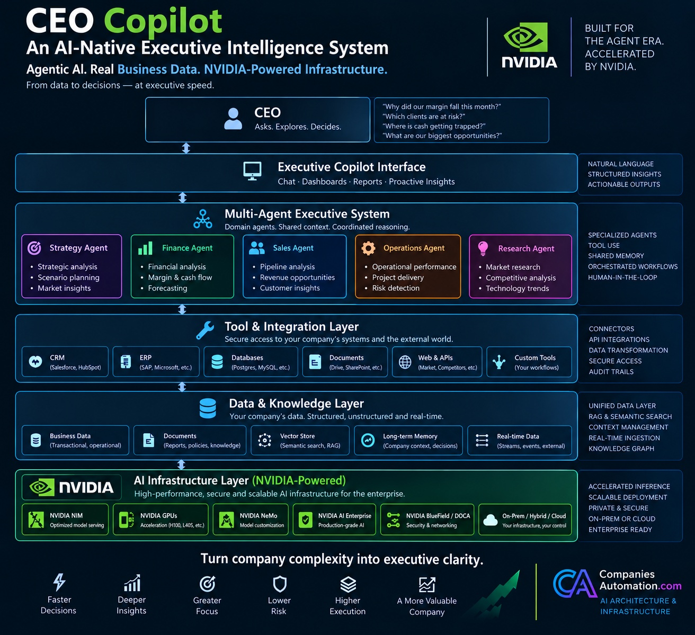

# AI-Native CEO Copilot

**An open reference architecture for AI-native executive intelligence — combining agentic AI, enterprise data and NVIDIA-powered AI infrastructure.**

AI-Native CEO Copilot explores how agents, tools, memory, enterprise data and accelerated infrastructure can work together to help executives understand what is happening inside their companies — and why.



> This repository is a public technical showcase. It is intentionally separated from the private production codebase.

## Reference Architecture v0.1

The first public reference architecture is now available:

**[`docs/reference-architecture.md`](docs/reference-architecture.md)**

It covers the full stack from executive experience and agent orchestration to enterprise tools, data, governance, observability and NVIDIA AI infrastructure.

## The differentiation

Most CEO copilots stop at the application layer: chat, dashboards, prompts and integrations.

This project goes one layer deeper.

**The thesis is that the Agent Era is also an infrastructure problem.**

Agentic systems reason across multiple steps, call tools, retrieve data, preserve context, coordinate specialized agents and may execute many model invocations for a single executive question. That changes the workload — and makes inference architecture, latency, throughput, observability, security and deployment economics part of the product itself.

That is why AI-Native CEO Copilot treats **AI Infrastructure as a first-class architectural layer**, with NVIDIA technologies as a core reference platform.

## Why this exists

A CEO does not need another chatbot. A CEO needs a system that can:

- understand business context,
- inspect trusted company data,
- call tools,
- compare signals across functions,
- surface risks and opportunities,
- explain why something changed,
- preserve useful organizational context,
- and keep a human in control of consequential decisions.

This project explores what that system looks like when the application, agent and infrastructure layers are designed together.

## Example executive questions

```text
Why did our gross margin fall this month?

Where is cash getting trapped?

Which clients are becoming financially risky?

Which projects are likely to miss margin targets?

What deserves my attention today?

Which sales opportunities have the highest expected value?
```

## Architecture

```text
                              CEO
                               |
                               v
                   Executive Copilot Interface
                               |
                               v
                  Multi-Agent Executive System
                               |
           +-------------------+-------------------+
           |                   |                   |
           v                   v                   v
       Strategy             Finance            Operations
        Agent                Agent                Agent
           \\                   |                   /
            +--------- Sales / Research ----------+
                               |
                               v
                    Tool & Integration Layer
                               |
           CRM | ERP | Databases | Docs | APIs
                               |
                               v
                    Data & Knowledge Layer
                               |
               RAG | Memory | Real-time Data
                               |
                               v
               NVIDIA-Powered AI Infrastructure
                               |
       NIM | GPUs | NeMo | AI Enterprise | BlueField
                               |
                               v
                  Grounded Executive Output
```

See [`docs/reference-architecture.md`](docs/reference-architecture.md) for the complete reference architecture.

## NVIDIA-powered AI infrastructure

The infrastructure layer is intentionally visible in this project instead of being treated as an invisible hosting detail.

Reference areas include:

- **NVIDIA NIM** for optimized model serving,
- **NVIDIA GPUs** for accelerated inference and AI workloads,
- **NVIDIA NeMo** for model customization and enterprise AI workflows,
- **NVIDIA AI Enterprise** for production-grade AI software,
- **NVIDIA BlueField / DOCA** for security, networking and infrastructure acceleration,
- on-prem, hybrid and cloud deployment patterns,
- inference economics and model routing,
- observability for agentic workloads,
- scaling from a single executive workflow to multi-agent enterprise systems.

The goal is not to bolt NVIDIA branding onto an AI app. The goal is to explore **how infrastructure choices change what an enterprise agentic system can actually do in production**.

## Core design principles

- **Agentic, not chatbot-first** — designed around reasoning, tools and business actions.
- **Infrastructure-aware** — agentic workloads are treated differently from traditional chat workloads.
- **Source-grounded** — outputs should be traceable to business data and evidence.
- **Human-in-the-loop** — consequential decisions remain under executive control.
- **Tool-driven** — agents query systems instead of inventing answers from context alone.
- **Observable by design** — actions, sources, latency and execution paths should be inspectable.
- **Private-deployment ready** — enterprise data boundaries matter from day one.
- **Model-agnostic orchestration** — the system should not depend on a single model provider.
- **Accelerated where it matters** — infrastructure is chosen according to workload, latency and economics.

## What this repository will contain

This public repository focuses on the parts useful for learning, evaluation and technical discussion:

- reference architecture,
- executive use cases,
- agent interfaces,
- demo workflows,
- synthetic company data,
- dashboard examples,
- security principles,
- observability patterns,
- NVIDIA-oriented deployment patterns,
- inference and infrastructure experiments.

Production prompts, proprietary workflows, customer integrations, credentials and sensitive implementation details are intentionally excluded.

## Initial use cases

### 1. Margin intelligence

**Question:** Why did gross margin decline?

The system should inspect revenue, direct costs, project performance and anomalous changes, then produce a source-grounded explanation.

### 2. Cash-flow risk

**Question:** Where is cash getting trapped?

The system can combine receivables, payables, project timing and customer behavior to highlight emerging liquidity risks.

### 3. Sales prioritization

**Question:** Which opportunities deserve executive attention?

The system can combine pipeline value, close probability, strategic importance, sales activity and historical conversion behavior.

### 4. Operational risk

**Question:** Which projects are likely to miss margin or delivery targets?

The system can reason over delays, materials, subcontractors, scope changes, costs and delivery signals.

## Repository map

```text
AI-Native-CEO-Copilot/
|
+-- README.md
+-- ceo-copilot-architecture.jpg
+-- docs/
|   +-- reference-architecture.md
|   +-- architecture.md
|   +-- executive-use-cases.md
|   +-- security.md
|   +-- roadmap.md
|
+-- examples/
|   +-- margin-analysis/
|   +-- cash-flow-risk/
|   +-- sales-pipeline/
|
+-- demo-data/
+-- src/
|   +-- agents/
|   +-- tools/
|   +-- memory/
|   +-- workflows/
|   +-- ui/
|   +-- observability/
|   +-- infrastructure/
|
+-- .env.example
```

## Current status

**v0.1 — architecture and public technical showcase.**

The production version of CEO Copilot is being developed separately. This repository will expose selected reference implementations, infrastructure experiments and demo workflows over time.

## The thesis

**The shift from chatbots to agents changes both the software architecture and the infrastructure underneath it.**

An agent may reason across multiple steps, call tools, retrieve data, spawn sub-tasks, preserve growing context and coordinate with other agents. Enterprise AI therefore has to think about orchestration, memory, observability, data access, security, inference economics and accelerated infrastructure together.

CEO Copilot is a practical place to explore that shift from the executive interface all the way down to the AI infrastructure layer.

## Enterprise deployments

The public repository is not the production system.

Private deployments may include:

- ERP / CRM / BI integrations,
- custom executive workflows,
- role-based access control,
- private data boundaries,
- model routing,
- observability and audit trails,
- custom agents,
- NVIDIA-accelerated inference infrastructure,
- on-prem / hybrid / cloud deployment patterns,
- workload and inference optimization.

For enterprise implementation, AI architecture and AI infrastructure work: **[CompaniesAutomation.com](https://companiesautomation.com/en)**.

## Author

**Rubén García**  
AI Engineering · Agentic Systems · Enterprise Automation · NVIDIA AI Infrastructure

---

If this architecture is useful to you, follow the repository. The goal is to turn it into a practical reference for building AI-native executive systems from the application layer down to the infrastructure layer.